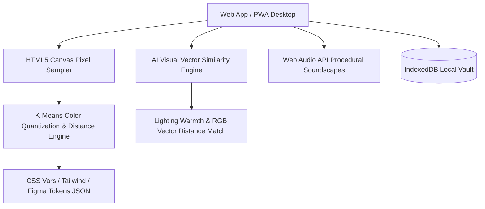

# Mood Archive — Personal Aesthetic & Vibe Vault ✨

<p align="center">
  
</p>

<p align="center">
  <b>A distraction-free, open-source aesthetic reference vault & moodboard studio.</b><br/>
  Tag images by emotion and aesthetic, extract dynamic color palettes, calculate AI visual vectors, and curate reference galleries by vibe.
</p>

<p align="center">
  <a href="#-features"></a>
  <a href="#-features"></a>
  <a href="#-features"></a>
  <a href="#-features"></a>
  <a href="#-i18n-localization"></a>
  <a href="#-license"></a>
</p>

---

## 📸 Highlights & System Architecture



---

## ✨ Features

### 1. 🏷️ Multi-Dimensional Tagging & Taxonomy
Classify your visual references across two distinct dimensions:
* **Emotions**: *Cyber-noir*, *Nostalgic*, *Serene*, *Melancholic*, *Euphoric*, *Cozy*, *Solitude*, *Wanderlust*, *Ethereal*, *Anxious*, *Dreamy*, *Mysterious*, *Rebellious*.
* **Aesthetics**: *Cyberpunk*, *Dark Academia*, *Cottagecore*, *Minimalist*, *Film Grain*, *Wabi-Sabi*, *Vaporwave*, *Brutalist*, *Surrealism*, *Monochrome*, *Botanical*, *Cinematic*, *Neubrutalism*.

### 2. 🎨 Vibe Palette Studio
* Extract authentic 5-to-8 color palettes from photography in real-time.
* Preview design tokens live on interactive UI cards and button previews.
* Export tokens instantly in **CSS Custom Variables**, **Tailwind CSS config**, and **Figma Tokens JSON**.

### 3. 🖼️ Freeform Moodboard Canvas
* Interactive composition workspace where you can drag, scale, rotate (-15° to +15° slants), layer z-depth, and attach sticky text notes.
* Save board compositions directly to local storage.

### 4. 🧠 AI Visual Vector & Similarity Search
* **Lighting Warmth Vector**: Calculates warmth ($\text{Warmth} = \frac{R + 0.5G - B}{255}$), luminance, and contrast.
* **Vector Similarity Engine**: Calculates Euclidean color histogram distance ($d = \sqrt{\Delta R^2 + \Delta G^2 + \Delta B^2}$) to recommend visually similar photography.

### 5. 📥 Pinterest & Web Board Bulk Importer
* Paste direct image URLs or board link lists to batch import photo archives with automatic palette extraction and tag classification.

### 6. 🎧 Procedural Web Audio API Soundscapes
* Built-in sound synthesizer generating 5 ambient audio environments:
  - 🌧️ **Midnight Rain**
  - 📻 **Vinyl Warmth**
  - 🛰️ **Deep Space Drone**
  - 🌊 **Twilight Ocean**
  - 🔥 **Hearth Fire**

---

## 🌐 i18n Localization

Mood Archive natively supports 6 languages with instant hot-swapping:
- 🇺🇸 **English** (`EN`)
- 🇯🇵 **日本語** (`JA`)
- 🇫🇷 **Français** (`FR`)
- 🇩🇪 **Deutsch** (`DE`)
- 🇪🇸 **Español** (`ES`)
- 🇰🇷 **한국어** (`KO`)

---

## ⚡ Quick Start

```bash
# 1. Clone the repository
git clone https://github.com/Wicje/Mood-Archive.git
cd Mood-Archive

# 2. Install dependencies
npm install

# 3. Launch local dev server
npm run dev
```

Visit `http://localhost:5173/` in your browser.

---

## 🏗️ Project Structure

```text
mood-archive/
├── public/
│   └── manifest.json         # PWA Web App Manifest
├── src/
│   ├── components/
│   │   ├── AmbianceBar.tsx            # Web Audio Soundscape Player
│   │   ├── ImageDetailModal.tsx       # Lightbox & AI Prompt Synthesizer
│   │   ├── ImageGrid.tsx              # Masonry / Grid / Filmstrip Layout
│   │   ├── MoodboardCanvas.tsx        # Freeform Composition Canvas
│   │   ├── Navbar.tsx                 # Header & Language Selector
│   │   ├── PinterestImporterModal.tsx # Bulk URL Importer
│   │   ├── SidebarFilter.tsx          # Tag & Color Filter Panel
│   │   ├── UploadModal.tsx            # File & URL Upload Modal
│   │   ├── VibePaletteStudio.tsx      # Palette Extractor & Token Exporter
│   │   └── VibeRouletteModal.tsx       # Surprise Vibe Wheel
│   ├── data/
│   │   └── initialArchive.ts          # Curated Preset Photography Dataset
│   ├── services/
│   │   ├── audioSynth.ts              # Web Audio Procedural Oscillators
│   │   ├── colorExtractor.ts          # Canvas K-Means Color Quantizer
│   │   ├── i18n.ts                    # 6-Language Translation Engine
│   │   ├── storage.ts                 # IndexedDB Persistent Storage
│   │   └── visualAI.ts                # AI Color Vector Similarity Math
│   ├── types/
│   │   └── index.ts                   # TypeScript Interfaces
│   ├── App.tsx                        # Main Workspace Component
│   ├── index.css                      # Design Tokens & Keyframe Animations
│   └── main.tsx                       # React DOM Entry
├── package.json
└── vite.config.js
```

---

## 📄 License

Distributed under the **MIT License**. Free, open-source, and distraction-free forever.
